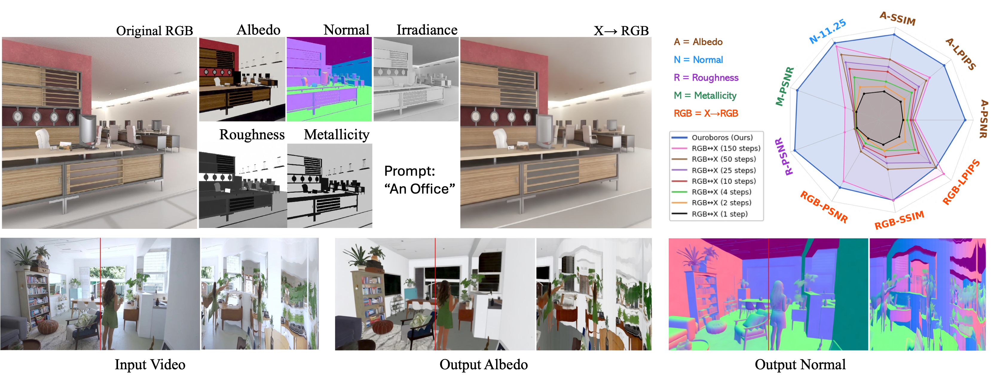

# Ouroboros

> **Ouroboros: Single-step Diffusion Models for Cycle-consistent Forward and Inverse Rendering**
> 
> [Shanlin Sun*]([https://siwensun.github.io/]), [Yifan Wang]([https://yfwang.me/]), [Hanwen Zhang]([https://github.com/zhw123456789/]), [Ruogu Fang]([https://lab-smile.github.io/]), [Xiaohui Xie]([https://ics.uci.edu/~xhx/]) and [Chenyu You]([https://chenyuyou.me/])
>
> - Presented by University of California, Irvine; Huazhong University of Science and Technology; University of Florida; Stony Brook University
> - :mailbox_with_mail: Primary contact: [Shanlin Sun]([https://siwensun.github.io/]) ( shanlins@uci.edu )
>

## Highlights 

:star2: Ouroboros is a neural lighting simulator for image decomposition and composition.

:star2: Single-step diffusion models for cycle-consistent lighting simulator. 

:star2: Zero-shot generalized to neural video inverse and forward rendering.

## 📰 News

## 📝 TODO List

- \[ \] Release Arxiv.
- \[ \] Release full implementation and checkpoints.
- \[ \] Release training data.
